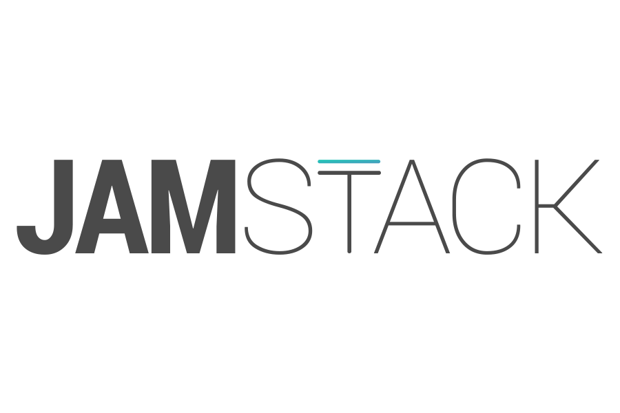

Javascript, API and Markup. That is what the Jam in the stack stand for. Javascript for dynamic content, APIs that abstract database and Markup for the static content for the website. During the development of this website, I come across this term when looking for cheap and fast design pattern to follow. The Jamstack basically says that there should be no databases, no webserver. You just have to put up the project in git, build it once and let a CDN like github pages or netlify point towards it.

Previously, web developers uses components and templating engines to improve code reusability and provide dynamic content. The user will go to a link and the server will create the page with dynamic content and serve it to the user. The rendering process used to take a considerable amount of resource as it needs to do thousand of templates. There are ways around it like caching pages, but for small website that was less than a hundred page or when changes to content happen infrequently. 

The JAM stack is a simple pattern as you just have to focus on creating front end of the website. Any dynamic content will be neither generated with markup or fetch from a serverless API. By separating the UI and content, websites are resembling desktop or mobile applications more and more. Where there is only the client application to delivered to the user and they consume the data through the site.

More and more services are being designed to be achieved through APIs. This evolution is largely thanks to the rise of mobile applications. Mobile developers realize they need a way to deliver dynamic content to their app without a server serving the application. The rise of Graphql also was due to APIs delivering increasingly large amount of data and Graphql being a solution to query APIs so you get what you wanted.

Now you can get largely everything done through an API service. User authentication can be done with 0auth or firebase, comments can be done with disqus. Serverless computing also give meant that your backend can abstracted even further. When creating a Jam app, the flow will mimic a desktop or mobile application.

Again, I like the Jamstack architecture because you will be building the site like a mobile app or desktop app so that backend APIs are simplified and reusable for multiple platform. It is basically following the progressive web app ethos. While there are pros to doing native, I do think that for small to mid size projects its a great way to reduce development time ad streamline multiple platform development.
